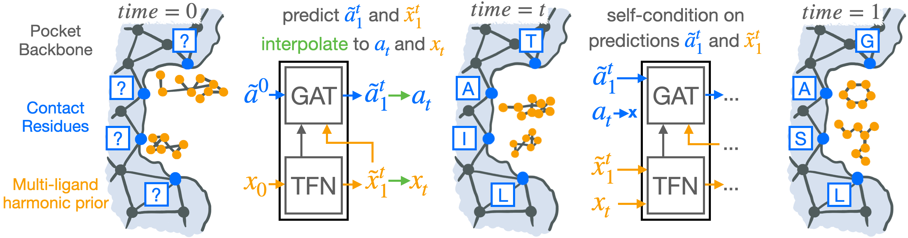
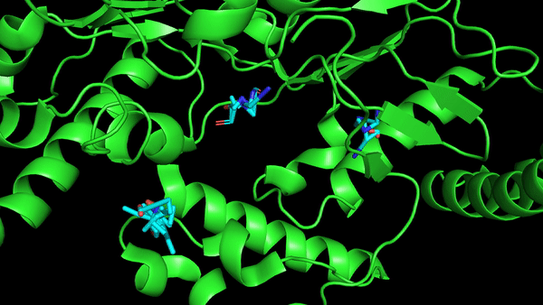

# <span style="color:#016fff;">FlowSite</span> and <span style="color:#f99e01;">HarmonicFlow</span>

### [Paper on arXiv](https://arxiv.org/abs/2310.05764)

Code of FlowSite and HarmonicFlow. HarmonicFlow generates binding structures for single ligands or "multi-ligands" (multiple small molecules and ions bound to the same pocket). 
FlowSite builds on HarmonicFlow and generates residues types for binding sites to bind a specific (multi-)ligand.

Feel free to reach out with any questions! [hstark@mit.edu](hstark@mit.edu)

FlowSite generative process:

HarmonicFlow multi-ligand structure generation gif:



## Setup Environment

We will set up the environment using [Anaconda](https://docs.anaconda.com/anaconda/install/index.html).
This is an example for how to set up a working conda environment to run the code. Make sure that the pytorch and pytorch-geometric versions you use are compatible with each other. Also, if you do not use a GPU, use `cpu` instead of `cu121` in the last line (also make sure that you use the correct cuda version if you do have a gpu).

    conda create -c conda-forge -n flowsite rdkit python
    pip install torch torchvision torchaudio
    pip install torch_geometric
    pip install pyyaml wandb biopython spyrmsd einops biopandas plotly prody tqdm lightning imageio
    pip install e3nn

    pip install torch_scatter torch_sparse torch_cluster -f https://data.pyg.org/whl/torch-2.1.0+cu121.html

Alternatively there is also an `environment.yml` file that you can use with `conda env create -f environment.yml`.

## Design your Binding sites

1. Download the weights for the trained models from [here](https://drive.google.com/file/d/1QGQ6U3BDlEZ682yv7dLo2wbuulOPArSY/view?usp=sharing) and place them into the `pocket_gen` directory.

2. Here are two example commands for running FlowSite using either of the two models we provide. In the first one the inputs are specified via `data/inference_csv_example.csv` and in the second via commandline arguments. The outputs are saved to `out_dir`.
```
CUDA_VISIBLE_DEVICES="0" python -m inference --num_inference 10 --out_dir data/inference_out --csv_file data/inference_csv_example.csv --batch_size 16 --checkpoint pocket_gen/lf5t55w4/checkpoints/best.ckpt --run_test --run_name inference1 --wandb  --layer_norm --fake_constant_dur 100000 --fake_decay_dur 10 --fake_ratio_start 0.2 --fake_ratio_end 0.2 --residue_loss_weight 0.2 --use_tfn --use_inv --time_condition_tfn --correct_time_condition --time_condition_inv --time_condition_repeat --flow_matching --flow_matching_sigma 0.5 --prior_scale 1 --num_angle_pred 5 --ns 48 --nv 12 --batch_norm --self_condition_x --self_condition_inv --no_tfn_self_condition_inv --self_fancy_init
CUDA_VISIBLE_DEVICES="0" python -m inference --num_inference 10 --out_dir data/inference_out2 --design_residues "A60-65,A232,A233,A212-215,A325" --ligand data/2fc2_HEM_HBI_HAR_NO.mol2 --protein data/2fc2_unit1_protein.pdb --batch_size 16 --pocket_def_ligand data/2fc2_HEM_HBI_HAR_NO.mol2 --checkpoint pocket_gen/lf5t55w4/checkpoints/best.ckpt --run_test --run_name inference1 --wandb  --layer_norm --fake_constant_dur 100000 --fake_decay_dur 10 --fake_ratio_start 0.2 --fake_ratio_end 0.2 --residue_loss_weight 0.2 --use_tfn --use_inv --time_condition_tfn --correct_time_condition --time_condition_inv --time_condition_repeat --flow_matching --flow_matching_sigma 0.5 --prior_scale 1 --num_angle_pred 5 --ns 48 --nv 12 --batch_norm --self_condition_x --self_condition_inv --no_tfn_self_condition_inv --self_fancy_init
```
3. You can specify the ligand either via a file using `--ligand` or as a smiles using `--smiles`.
4. The important command line arguments are the following:
```
--out_dir              type=str, default='data/inference_out' :                 Path to output directory.
--num_inference        type=int, default=1 :                                    How many sequences to generate for each complex.
--csv_file             type=str, default='data/inference_csv_example.csv' :     Path to a CSV file where you can specify the inputs below for multiple complexes.
--ligand               type=str, default=None :  Path to a ligand file. Either this or the smiles must be specified (or the csv).
--smiles               type=str, default=None :  Ligand as smiles string. Either this or the ligand as path must be specified (or the csv).
--protein              type=str, default=None :  Path to a protein file
--design_residues      type=str, default=None :  Residues you want to design. In this format of chain ID and residue number(s): "A60-65,A232,A233,B212-215,B325"

--pocket_def_ligand    type=str, default=None :  Path to a ligand file via which the pocket should be specified in the Distance pocket definition. E.g., an .sdf, .mol2 or .pdb file.
--pocket_def_residues  type=str, default=None :  Residues that you think would be close to the bound ligand for specifying the pocket in a format like this: "A60-65,A232,A233,A212-215,A325"
--pocket_def_center    type=str, default=None :  String to define a pocket center like this: "-0.214,30.197,9.017"
```
5. Using `pocket_def_ligand` will use all residues close to that ligand as the pocket.
6. If you use `pocket_def_residues` or `pocket_def_center` to define your pocket, we recommend using a different set of model weights: `--checkpoint pocket_gen/b1ribx1a/checkpoints/best.ckpt` and `--ns 32 --nv 8` instead of `--ns 48 --nv 12`.


## Retrain FlowSite/HarmonicFlow or run trained model on test set

### Dataset

The files in `index` contain the names for the sequence and time splits of pdbbind and moad.

To obtain the pdbbind data:
1. download it from [zenodo](https://zenodo.org/record/6408497)
2. unzip the directory and place it into `data` such that you have the path `data/PDBBind_processed`

To obtain the binding MOAD data:
1. download it from [here](https://bindingmoad.org/)
2. unzip the directory and place it into `data` such that you have the path `data/moad/BindingMOAD_2020`
3. run `python moad_unit2pdb.py`

### Running on the test set with trained models

Run on the test set using trained model weights like this (model weights are [here](https://drive.google.com/file/d/1QGQ6U3BDlEZ682yv7dLo2wbuulOPArSY/view?usp=sharing)): 
```
CUDA_VISIBLE_DEVICES="2" python -m train --run_name test_HarmonicFlow_timesplit_DistPock --wandb --run_test --checkpoint pocket_gen/duw71q7p/checkpoints/best.ckpt --lr 1e-3 --batch_size 4 --train_split_path index/timesplit_no_lig_overlap_train --val_split_path index/timesplit_no_lig_overlap_val --predict_split_path index/timesplit_test --clamp_loss 10 --epochs 150 --num_inference 10 --gradient_clip_val 1 --save_inference --check_nan_grads --num_all_res_train_epochs 100000 --fake_constant_dur 0 --fake_decay_dur 0 --fake_ratio_start 0 --fake_ratio_end 0 --residue_loss_weight 0 --use_tfn --time_condition_tfn --correct_time_condition --time_condition_inv --time_condition_repeat --flow_matching --flow_matching_sigma 0.5 --prior_scale 1 --layer_norm --tfn_detach --max_lig_size 200 --num_workers 4 --check_val_every_n_epoch 1 --cross_radius 50 --protein_radius 30 --lig_radius 50  --ns 32 --nv 8 --tfn_use_aa_identities --self_condition_x --pocket_residue_cutoff_sigma 0.5 --pocket_center_sigma 0.2 --pocket_type ca_distance --pocket_residue_cutoff 14 

CUDA_VISIBLE_DEVICES="0" python -m train --run_name test_FlowSite_pdbbind_seqSimSplit --wandb --run_test --checkpoint pocket_gen/89b8ojq8/checkpoints/best.ckpt --batch_size 16 --train_split_path index/pdbbind_mmseqs_30sim_train.txt --val_split_path index/pdbbind_mmseqs_30sim_val.txt --predict_split_path index/pdbbind_mmseqs_30sim_test.txt --pocket_residue_cutoff 12 --clamp_loss 10 --epochs 150 --num_inference 10 --layer_norm --gradient_clip_val 1 --save_inference --check_nan_grads --num_all_res_train_epochs 100000 --fake_constant_dur 100000 --fake_decay_dur 10 --fake_ratio_start 0.2 --fake_ratio_end 0.2 --residue_loss_weight 0.2 --use_tfn --use_inv --time_condition_tfn --correct_time_condition --time_condition_inv --time_condition_repeat --flow_matching --flow_matching_sigma 0.5 --prior_scale 1 --num_angle_pred 5 --ns 32 --nv 8 --batch_norm --self_condition_x --self_condition_inv --no_tfn_self_condition_inv --self_fancy_init
```

### Retrain HarmonicFlow and FlowSite
If training stopped for some reason you can restart by using `--checkpoint wandbProjectName/<WANDB run id goes here>/last.ckpt`. 

FlowSite PDBBind and Binding MOAD:
```
CUDA_VISIBLE_DEVICES="0" python -m train --run_name FlowSite_pdbbind --wandb --batch_size 16 --train_split_path index/pdbbind_mmseqs_30sim_train.txt --val_split_path index/pdbbind_mmseqs_30sim_val.txt --predict_split_path index/pdbbind_mmseqs_30sim_test.txt --pocket_residue_cutoff 12 --clamp_loss 10 --epochs 150 --num_inference 5 --layer_norm --gradient_clip_val 1 --save_inference --check_nan_grads --fake_constant_dur 100000 --fake_decay_dur 10 --fake_ratio_start 0.2 --fake_ratio_end 0.2 --residue_loss_weight 0.2 --use_tfn --use_inv --time_condition_tfn --correct_time_condition --time_condition_inv --time_condition_repeat --flow_matching --flow_matching_sigma 0.5 --prior_scale 1 --num_angle_pred 5 --ns 32 --nv 8 --batch_norm --self_condition_x --self_condition_inv --no_tfn_self_condition_inv --standard_style_self_condition_inv --self_fancy_init

CUDA_VISIBLE_DEVICES="0" python -m train --run_name FlowSite_moad --wandb --batch_size 16 --train_split_path index/moad_mmseqs_30sim_train --val_split_path index/moad_mmseqs_30sim_val --predict_split_path index/moad_mmseqs_30sim_test --data_dir data/moad/moad_prepared --data_source moad --biounit1_only --pocket_residue_cutoff 12 --clamp_loss 10 --epochs 150 --num_inference 5 --layer_norm --gradient_clip_val 1 --save_inference --check_nan_grads --fake_constant_dur 100000 --fake_decay_dur 10 --fake_ratio_start 0.2 --fake_ratio_end 0.2 --residue_loss_weight 0.2 --use_tfn --use_inv --time_condition_tfn --correct_time_condition --time_condition_inv --time_condition_repeat --flow_matching --flow_matching_sigma 0.5 --prior_scale 1 --num_angle_pred 5 --ns 32 --nv 8 --batch_norm --self_condition_x --self_condition_inv --min_num_contacts 2 --no_tfn_self_condition_inv --self_fancy_init --correct_moad_lig_selection --check_val_every_n_epoch 3 --standard_style_self_condition_inv
```

HarmonicFlow on PDBBind with residue identities:
```
CUDA_VISIBLE_DEVICES="0" python -m train --run_name HarmonicFlow_SeqSimSplit_DistPock --wandb --lr 1e-3 --batch_size 4 --train_split_path index/pdbbind_mmseqs_30sim_train.txt --val_split_path index/pdbbind_mmseqs_30sim_val.txt --predict_split_path index/pdbbind_mmseqs_30sim_test.txt --clamp_loss 10 --epochs 150 --num_inference 10 --gradient_clip_val 1 --check_nan_grads --num_all_res_train_epochs 100000 --fake_constant_dur 0 --fake_decay_dur 0 --fake_ratio_start 0 --fake_ratio_end 0 --residue_loss_weight 0 --use_tfn --time_condition_tfn --correct_time_condition --time_condition_inv --time_condition_repeat --flow_matching --flow_matching_sigma 0.5 --prior_scale 1 --layer_norm --tfn_detach --max_lig_size 200 --num_workers 4 --check_val_every_n_epoch 1 --cross_radius 50 --protein_radius 30 --lig_radius 50  --ns 32 --nv 8 --tfn_use_aa_identities --self_condition_x --pocket_residue_cutoff_sigma 0.5 --pocket_center_sigma 0.2 --pocket_residue_cutoff_sigma 0.5 --pocket_center_sigma 0.2 --pocket_type ca_distance --pocket_residue_cutoff 14 

CUDA_VISIBLE_DEVICES="2" python -m train --run_name HarmonicFlow_timesplit_DistPock --wandb --lr 1e-3 --batch_size 4 --train_split_path index/timesplit_no_lig_overlap_train --val_split_path index/timesplit_no_lig_overlap_val --predict_split_path index/timesplit_test --clamp_loss 10 --epochs 150 --num_inference 10 --gradient_clip_val 1 --save_inference --check_nan_grads --num_all_res_train_epochs 100000 --fake_constant_dur 0 --fake_decay_dur 0 --fake_ratio_start 0 --fake_ratio_end 0 --residue_loss_weight 0 --use_tfn --time_condition_tfn --correct_time_condition --time_condition_inv --time_condition_repeat --flow_matching --flow_matching_sigma 0.5 --prior_scale 1 --layer_norm --tfn_detach --max_lig_size 200 --num_workers 4 --check_val_every_n_epoch 1 --cross_radius 50 --protein_radius 30 --lig_radius 50  --ns 32 --nv 8 --tfn_use_aa_identities --self_condition_x --pocket_residue_cutoff_sigma 0.5 --pocket_center_sigma 0.2 --pocket_residue_cutoff_sigma 0.5 --pocket_center_sigma 0.2 --pocket_type ca_distance --pocket_residue_cutoff 14 

CUDA_VISIBLE_DEVICES="5" python -m train --run_name HarmonicFlow_timesplit_RadPock --wandb --lr 1e-3 --batch_size 4 --train_split_path index/timesplit_no_lig_overlap_train --val_split_path index/timesplit_no_lig_overlap_val --predict_split_path index/timesplit_test --clamp_loss 10 --epochs 150 --num_inference 10 --gradient_clip_val 1 --save_inference --check_nan_grads --num_all_res_train_epochs 100000 --fake_constant_dur 0 --fake_decay_dur 0 --fake_ratio_start 0 --fake_ratio_end 0 --residue_loss_weight 0 --use_tfn --time_condition_tfn --correct_time_condition --time_condition_inv --time_condition_repeat --flow_matching --flow_matching_sigma 0.5 --prior_scale 1 --layer_norm --tfn_detach --max_lig_size 200 --num_workers 4 --check_val_every_n_epoch 1 --cross_radius 50 --protein_radius 30 --lig_radius 50  --ns 32 --nv 8 --tfn_use_aa_identities --self_condition_x --pocket_residue_cutoff_sigma 0.5 --pocket_center_sigma 0.2 --pocket_type radius --radius_pocket_buffer 7 

CUDA_VISIBLE_DEVICES="7" python -m train --run_name HarmonicFlow_SeqSimSplit_RadPock --wandb --lr 1e-3 --batch_size 4 --train_split_path index/pdbbind_mmseqs_30sim_train.txt --val_split_path index/pdbbind_mmseqs_30sim_val.txt --predict_split_path index/pdbbind_mmseqs_30sim_test.txt --clamp_loss 10 --epochs 150 --num_inference 10 --gradient_clip_val 1 --check_nan_grads --num_all_res_train_epochs 100000 --fake_constant_dur 0 --fake_decay_dur 0 --fake_ratio_start 0 --fake_ratio_end 0 --residue_loss_weight 0 --use_tfn --time_condition_tfn --correct_time_condition --time_condition_inv --time_condition_repeat --flow_matching --flow_matching_sigma 0.5 --prior_scale 1 --layer_norm --tfn_detach --max_lig_size 200 --num_workers 4 --check_val_every_n_epoch 1 --cross_radius 50 --protein_radius 30 --lig_radius 50  --ns 32 --nv 8 --tfn_use_aa_identities --self_condition_x --pocket_residue_cutoff_sigma 0.5 --pocket_center_sigma 0.2 --pocket_type radius --radius_pocket_buffer 7 
```

HarmonicFlow on Binding MOAD with residue identities:
```
CUDA_VISIBLE_DEVICES="0" python -m train --run_name HarmonicFlow_moad_RadPock --wandb --batch_size 4 --train_split_path index/moad_mmseqs_30sim_train --val_split_path index/moad_mmseqs_30sim_val --predict_split_path index/moad_mmseqs_30sim_test --data_dir data/moad/moad_prepared --data_source moad --biounit1_only --clamp_loss 10 --epochs 150 --num_inference 10 --gradient_clip_val 1 --save_inference --check_nan_grads --num_all_res_train_epochs 100000 --use_tfn --time_condition_tfn --correct_time_condition --time_condition_inv --time_condition_repeat --prior_scale 1 --layer_norm --tfn_detach --max_lig_size 150 --num_workers 4 --check_val_every_n_epoch 1 --cross_radius 50 --protein_radius 30 --lig_radius 50 --pocket_residue_cutoff 14 --pocket_type distance --ns 32 --nv 8 --tfn_use_aa_identities --self_condition_x --correct_moad_lig_selection --flow_matching --flow_matching_sigma 0.5

CUDA_VISIBLE_DEVICES="0" python -m train --run_name EigenFold_moad_RadPock --wandb --batch_size 4 --train_split_path index/moad_mmseqs_30sim_train --val_split_path index/moad_mmseqs_30sim_val --predict_split_path index/moad_mmseqs_30sim_test --data_dir data/moad/moad_prepared --data_source moad --biounit1_only --clamp_loss 10 --epochs 150 --num_inference 10 --gradient_clip_val 1 --save_inference --check_nan_grads --num_all_res_train_epochs 100000 --use_tfn --time_condition_tfn --correct_time_condition --time_condition_inv --time_condition_repeat --prior_scale 1 --layer_norm --tfn_detach --max_lig_size 150 --num_workers 4 --check_val_every_n_epoch 1 --cross_radius 50 --protein_radius 30 --lig_radius 50 --pocket_residue_cutoff 14 --pocket_type distance --ns 32 --nv 8 --tfn_use_aa_identities --self_condition_x --correct_moad_lig_selection
```


Binding Site Recovery PDBBind
```
CUDA_VISIBLE_DEVICES="0" python -m train --run_name noLig_pdbbind --wandb --batch_size 16 --train_split_path index/pdbbind_mmseqs_30sim_train.txt --val_split_path index/pdbbind_mmseqs_30sim_val.txt --predict_split_path index/pdbbind_mmseqs_30sim_test.txt --pocket_residue_cutoff 12 --pocket_type distance --clamp_loss 10 --batch_norm --gradient_clip_val 1 --save_inference --check_nan_grads --residue_loss_weight 1 --use_true_pos --use_inv --ignore_lig

CUDA_VISIBLE_DEVICES="0" python -m train --run_name 2dLig_pdbbind --wandb --batch_size 16 --train_split_path index/pdbbind_mmseqs_30sim_train.txt --val_split_path index/pdbbind_mmseqs_30sim_val.txt --predict_split_path index/pdbbind_mmseqs_30sim_test.txt --pocket_residue_cutoff 12 --pocket_type distance --clamp_loss 10 --batch_norm --gradient_clip_val 1 --save_inference --check_nan_grads --residue_loss_weight 1 --use_true_pos --use_inv --ignore_lig --lig2d_mpnn --lig_mpnn_layers 4 --lig2d_batch_norm

CUDA_VISIBLE_DEVICES="0" python -m train --run_name randomLigPos_pdbbind --wandb --batch_size 16 --train_split_path index/pdbbind_mmseqs_30sim_train.txt --val_split_path index/pdbbind_mmseqs_30sim_val.txt --predict_split_path index/pdbbind_mmseqs_30sim_test.txt --pocket_residue_cutoff 12 --pocket_type distance --clamp_loss 10 --layer_norm --gradient_clip_val 1 --save_inference --check_nan_grads --residue_loss_weight 1 --use_true_pos --use_inv --mask_lig_translation --mask_lig_pos

CUDA_VISIBLE_DEVICES="0" python -m train --run_name groundTruthPospdbbind --wandb --batch_size 16 --train_split_path index/pdbbind_mmseqs_30sim_train.txt --val_split_path index/pdbbind_mmseqs_30sim_val.txt --predict_split_path index/pdbbind_mmseqs_30sim_test.txt --pocket_residue_cutoff 12 --pocket_type distance --clamp_loss 10 --batch_norm --gradient_clip_val 1 --save_inference --check_nan_grads --residue_loss_weight 1 --use_true_pos --use_inv --fake_constant_dur 10000 --fake_decay_dur 40 --fake_ratio_start 0.2 --fake_ratio_end 0.2
```

Binding Site Recovery MOAD:
```
CUDA_VISIBLE_DEVICES="0" python -m train --run_name noLig_moad --wandb --batch_size 16 --train_split_path index/moad_mmseqs_30sim_train --val_split_path index/moad_mmseqs_30sim_val --predict_split_path index/moad_mmseqs_30sim_test --data_dir data/moad/moad_prepared --data_source moad --biounit1_only --pocket_residue_cutoff 12 --pocket_type distance --clamp_loss 10 --batch_norm --gradient_clip_val 1 --save_inference --check_nan_grads --residue_loss_weight 1 --use_true_pos --use_inv --min_num_contacts 2 --correct_moad_lig_selection --ignore_lig

CUDA_VISIBLE_DEVICES="0" python -m train --run_name 2dLig_moad --wandb --batch_size 16 --train_split_path index/moad_mmseqs_30sim_train --val_split_path index/moad_mmseqs_30sim_val --predict_split_path index/moad_mmseqs_30sim_test --data_dir data/moad/moad_prepared --data_source moad --biounit1_only --pocket_residue_cutoff 12 --pocket_type distance --clamp_loss 10 --batch_norm --gradient_clip_val 1 --save_inference --check_nan_grads --residue_loss_weight 1 --use_true_pos --use_inv --ignore_lig --lig2d_mpnn --lig_mpnn_layers 4 --lig2d_batch_norm --min_num_contacts 2 --correct_moad_lig_selection

CUDA_VISIBLE_DEVICES="0" python -m train --run_name randomLigPos_moad --wandb --batch_size 16 --train_split_path index/moad_mmseqs_30sim_train --val_split_path index/moad_mmseqs_30sim_val --predict_split_path index/moad_mmseqs_30sim_test --data_dir data/moad/moad_prepared --data_source moad --biounit1_only --pocket_residue_cutoff 12 --pocket_type distance --clamp_loss 10 --layer_norm --gradient_clip_val 1 --save_inference --check_nan_grads --residue_loss_weight 1 --use_true_pos --use_inv --mask_lig_translation --mask_lig_pos --correct_moad_lig_selection --min_num_contacts 2

CUDA_VISIBLE_DEVICES="0" python -m train --run_name groundTruthPosmoad --wandb --batch_size 16 --train_split_path index/moad_mmseqs_30sim_train --val_split_path index/moad_mmseqs_30sim_val --predict_split_path index/moad_mmseqs_30sim_test --data_dir data/moad/moad_prepared --data_source moad --biounit1_only --pocket_residue_cutoff 12 --pocket_type distance --clamp_loss 10 --batch_norm --gradient_clip_val 1 --save_inference --check_nan_grads --residue_loss_weight 1 --use_true_pos --use_inv --min_num_contacts 2 --correct_moad_lig_selection --fake_constant_dur 100000 --fake_decay_dur 10 --fake_ratio_start 0.2 --fake_ratio_end 0.2
```

Flow matching investigation / ablation on PDBBind:
```
CUDA_VISIBLE_DEVICES="0" python -m train --run_name gaussian_prior --wandb --lr 1e-3 --batch_size 4 --train_split_path index/pdbbind_mmseqs_30sim_train.txt --val_split_path index/pdbbind_mmseqs_30sim_val.txt --predict_split_path index/pdbbind_mmseqs_30sim_test.txt --clamp_loss 10 --epochs 150 --num_inference 10 --gradient_clip_val 1 --check_nan_grads --num_all_res_train_epochs 100000 --fake_constant_dur 0 --fake_decay_dur 0 --fake_ratio_start 0 --fake_ratio_end 0 --residue_loss_weight 0 --use_tfn --time_condition_tfn --correct_time_condition --time_condition_inv --time_condition_repeat --flow_matching --flow_matching_sigma 0.5 --prior_scale 1 --layer_norm --tfn_detach --max_lig_size 150 --num_workers 4 --check_val_every_n_epoch 1 --cross_radius 50 --protein_radius 30 --lig_radius 50 --ns 32 --nv 8 --tfn_use_aa_identities --self_condition_x --gaussian_prior --pocket_residue_cutoff_sigma 0.5 --pocket_center_sigma 0.2 --pocket_type radius --radius_pocket_buffer 7 --checkpoint pocket_gen/rq5qv269/checkpoints/best.ckpt --run_test --project pocket_gen_inf

CUDA_VISIBLE_DEVICES="1" python -m train --run_name no_self-conditioning --wandb --lr 1e-3 --batch_size 4 --train_split_path index/pdbbind_mmseqs_30sim_train.txt --val_split_path index/pdbbind_mmseqs_30sim_val.txt --predict_split_path index/pdbbind_mmseqs_30sim_test.txt --clamp_loss 10 --epochs 150 --num_inference 10 --gradient_clip_val 1 --check_nan_grads --num_all_res_train_epochs 100000 --fake_constant_dur 0 --fake_decay_dur 0 --fake_ratio_start 0 --fake_ratio_end 0 --residue_loss_weight 0 --use_tfn --time_condition_tfn --correct_time_condition --time_condition_inv --time_condition_repeat --flow_matching --flow_matching_sigma 0.5 --prior_scale 1 --layer_norm --tfn_detach --max_lig_size 150 --num_workers 4 --check_val_every_n_epoch 1 --cross_radius 50 --protein_radius 30 --lig_radius 50 --ns 32 --nv 8 --tfn_use_aa_identities --pocket_residue_cutoff_sigma 0.5 --pocket_center_sigma 0.2 --pocket_type radius --radius_pocket_buffer 7 --checkpoint pocket_gen/lxyz3mgy/checkpoints/best.ckpt --run_test --project pocket_gen_inf

CUDA_VISIBLE_DEVICES="4" python -m train --run_name velocity_prediction --wandb --lr 1e-3 --batch_size 4 --train_split_path index/pdbbind_mmseqs_30sim_train.txt --val_split_path index/pdbbind_mmseqs_30sim_val.txt --predict_split_path index/pdbbind_mmseqs_30sim_test.txt --clamp_loss 10 --epochs 150 --num_inference 10 --gradient_clip_val 1 --check_nan_grads --num_all_res_train_epochs 100000 --fake_constant_dur 0 --fake_decay_dur 0 --fake_ratio_start 0 --fake_ratio_end 0 --residue_loss_weight 0 --use_tfn --time_condition_tfn --correct_time_condition --time_condition_inv --time_condition_repeat --flow_matching --flow_matching_sigma 0.5 --prior_scale 1 --layer_norm --tfn_detach --max_lig_size 150 --num_workers 4 --check_val_every_n_epoch 4 --cross_radius 50 --protein_radius 30 --lig_radius 50 --ns 32 --nv 8 --tfn_use_aa_identities --self_condition_x --velocity_prediction --pocket_residue_cutoff_sigma 0.5 --pocket_center_sigma 0.2 --pocket_type radius --radius_pocket_buffer 7 --checkpoint pocket_gen/wxlghchs/checkpoints/best.ckpt --run_test --project pocket_gen_inf

CUDA_VISIBLE_DEVICES="6" python -m train --run_name standard_tfn_layers --wandb --lr 1e-3 --batch_size 4 --train_split_path index/pdbbind_mmseqs_30sim_train.txt --val_split_path index/pdbbind_mmseqs_30sim_val.txt --predict_split_path index/pdbbind_mmseqs_30sim_test.txt --clamp_loss 10 --epochs 150 --num_inference 10 --gradient_clip_val 1 --check_nan_grads --num_all_res_train_epochs 100000 --fake_constant_dur 0 --fake_decay_dur 0 --fake_ratio_start 0 --fake_ratio_end 0 --residue_loss_weight 0 --use_tfn --time_condition_tfn --correct_time_condition --time_condition_inv --time_condition_repeat --flow_matching --flow_matching_sigma 0.5 --prior_scale 1 --layer_norm --tfn_detach --max_lig_size 150 --num_workers 4 --check_val_every_n_epoch 4 --cross_radius 50 --protein_radius 30 --lig_radius 50 --ns 32 --nv 8 --tfn_use_aa_identities --self_condition_x --fixed_lig_pos --update_last_when_fixed --pocket_residue_cutoff_sigma 0.5 --pocket_center_sigma 0.2 --pocket_type radius --radius_pocket_buffer 7 --checkpoint pocket_gen/7fe03ok3/checkpoints/best.ckpt --run_test --project pocket_gen_inf

CUDA_VISIBLE_DEVICES="2" python -m train --run_name HarmonicFlow_sig0 --wandb --lr 1e-3 --batch_size 4 --train_split_path index/pdbbind_mmseqs_30sim_train.txt --val_split_path index/pdbbind_mmseqs_30sim_val.txt --predict_split_path index/pdbbind_mmseqs_30sim_test.txt --clamp_loss 10 --epochs 150 --num_inference 10 --gradient_clip_val 1 --check_nan_grads --num_all_res_train_epochs 100000 --fake_constant_dur 0 --fake_decay_dur 0 --fake_ratio_start 0 --fake_ratio_end 0 --residue_loss_weight 0 --use_tfn --time_condition_tfn --correct_time_condition --time_condition_inv --time_condition_repeat --flow_matching --flow_matching_sigma 0 --prior_scale 1 --layer_norm --tfn_detach --max_lig_size 150 --num_workers 4 --check_val_every_n_epoch 1 --cross_radius 50 --protein_radius 30 --lig_radius 50 --ns 32 --nv 8 --tfn_use_aa_identities --self_condition_x --pocket_residue_cutoff_sigma 0.5 --pocket_center_sigma 0.2 --pocket_type radius --radius_pocket_buffer 7 --checkpoint pocket_gen/o8pnsut9/checkpoints/best.ckpt --run_test --project pocket_gen_inf

CUDA_VISIBLE_DEVICES="3" python -m train --run_name HarmonicFlow_sig05 --wandb --lr 1e-3 --batch_size 4 --train_split_path index/pdbbind_mmseqs_30sim_train.txt --val_split_path index/pdbbind_mmseqs_30sim_val.txt --predict_split_path index/pdbbind_mmseqs_30sim_test.txt --clamp_loss 10 --epochs 150 --num_inference 10 --gradient_clip_val 1 --check_nan_grads --num_all_res_train_epochs 100000 --fake_constant_dur 0 --fake_decay_dur 0 --fake_ratio_start 0 --fake_ratio_end 0 --residue_loss_weight 0 --use_tfn --time_condition_tfn --correct_time_condition --time_condition_inv --time_condition_repeat --flow_matching --flow_matching_sigma 0.5 --prior_scale 1 --layer_norm --tfn_detach --max_lig_size 150 --num_workers 4 --check_val_every_n_epoch 1 --cross_radius 50 --protein_radius 30 --lig_radius 50 --ns 32 --nv 8 --tfn_use_aa_identities --self_condition_x --pocket_residue_cutoff_sigma 0.5 --pocket_center_sigma 0.2 --pocket_type radius --radius_pocket_buffer 7 --checkpoint pocket_gen/3nvlg8qg/checkpoints/best.ckpt --run_test --project pocket_gen_inf
```

HarmonicFlow blind docking on PDBBind:
```
CUDA_VISIBLE_DEVICES="0" python -m train --run_name HarmonicFlow_blind_seqSimSplit --wandb --batch_size 4 --train_split_path index/pdbbind_mmseqs_30sim_train.txt --val_split_path index/pdbbind_mmseqs_30sim_val.txt --predict_split_path index/pdbbind_mmseqs_30sim_test.txt --clamp_loss 10 --epochs 250 --num_inference 10 --gradient_clip_val 1 --save_inference --check_nan_grads --use_tfn --time_condition_tfn --correct_time_condition --time_condition_inv --time_condition_repeat --flow_matching --flow_matching_sigma 0.5 --prior_scale 1 --layer_norm --tfn_detach --max_lig_size 150 --num_workers 4 --check_val_every_n_epoch 5 --cross_radius 50 --protein_radius 30 --lig_radius 50 --full_prot_diffusion_center --ns 32 --nv 8 --tfn_use_aa_identities --self_condition_x 

CUDA_VISIBLE_DEVICES="0" python -m train --run_name HarmonicFlow_blind_timesplit --wandb --batch_size 4 --train_split_path index/timesplit_no_lig_overlap_train --val_split_path index/timesplit_no_lig_overlap_val --predict_split_path index/timesplit_test --clamp_loss 10 --epochs 250 --num_inference 10 --gradient_clip_val 1 --save_inference --check_nan_grads --use_tfn --time_condition_tfn --correct_time_condition --time_condition_inv --time_condition_repeat --flow_matching --flow_matching_sigma 0.5 --prior_scale 1 --layer_norm --tfn_detach --max_lig_size 150 --num_workers 4 --check_val_every_n_epoch 5 --cross_radius 50 --protein_radius 30 --lig_radius 50 --full_prot_diffusion_center --ns 32 --nv 8 --tfn_use_aa_identities --self_condition_x 

CUDA_VISIBLE_DEVICES="0" python -m train --run_name HarmonicFlow_blind_seqSimSplit_noResidueIdentities --wandb --batch_size 4 --train_split_path index/pdbbind_mmseqs_30sim_train.txt --val_split_path index/pdbbind_mmseqs_30sim_val.txt --predict_split_path index/pdbbind_mmseqs_30sim_test.txt --clamp_loss 10 --epochs 250 --num_inference 10 --gradient_clip_val 1 --save_inference --check_nan_grads --use_tfn --time_condition_tfn --correct_time_condition --time_condition_inv --time_condition_repeat --flow_matching --flow_matching_sigma 0.5 --prior_scale 1 --layer_norm --tfn_detach --max_lig_size 150 --num_workers 4 --check_val_every_n_epoch 5 --cross_radius 50 --protein_radius 30 --lig_radius 50 --full_prot_diffusion_center --ns 32 --nv 8 

CUDA_VISIBLE_DEVICES="0" python -m train --run_name HarmonicFlow_blind_timesplit_noResidueIdentities --wandb --batch_size 4 --train_split_path index/timesplit_no_lig_overlap_train --val_split_path index/timesplit_no_lig_overlap_val --predict_split_path index/timesplit_test --clamp_loss 10 --epochs 250 --num_inference 10 --gradient_clip_val 1 --save_inference --check_nan_grads --use_tfn --time_condition_tfn --correct_time_condition --time_condition_inv --time_condition_repeat --flow_matching --flow_matching_sigma 0.5 --prior_scale 1 --layer_norm --tfn_detach --max_lig_size 150 --num_workers 4 --check_val_every_n_epoch 5 --cross_radius 50 --protein_radius 30 --lig_radius 50 --full_prot_diffusion_center --ns 32 --nv 8 
```